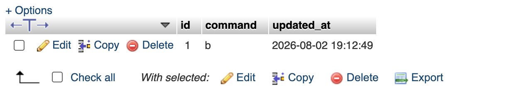
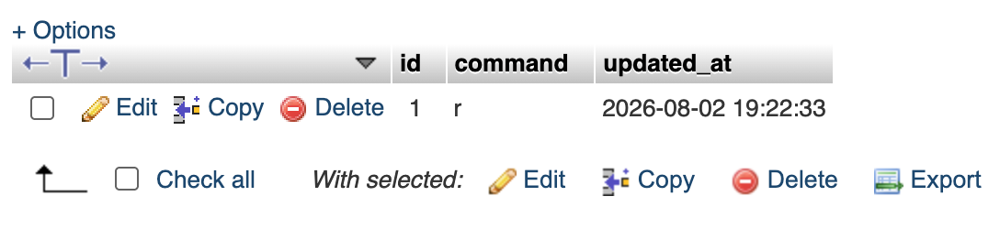

# Robot Control Web Interface

## Project Overview

This project is a web-based robot control interface built with PHP and MySQL.

The web page allows users to control the robot by pressing direction buttons. Each command is stored in the MySQL database, where it can later be read by the robot controller.

---

# Project Setup

The following steps were completed to run the project:

1. Created a free hosting account on InfinityFree.
2. Created a MySQL database.
3. Imported the `setup.sql` file into phpMyAdmin.
4. Updated the database credentials inside `db.php`.
5. Uploaded the project files to the `htdocs` directory.
6. Opened the website and tested the control buttons.

---

# Project Files

- `index.html` – Robot control interface.
- `db.php` – Database connection.
- `update_command.php` – Updates the robot command in the database.
- `get_state.php` – Retrieves the current robot command.
- `setup.sql` – Creates the required database table.

---

# Database

Table:

```
robot_state
```

Columns:

- id
- command
- updated_at

---

# Test Result

The website was tested successfully.

Each button updates the value stored in the `command` field inside the database.

Examples:

- Forward → F
- Backward → B
- Left → L
- Right → R
- Stop → S

---

# Screenshot



# Screenshot


